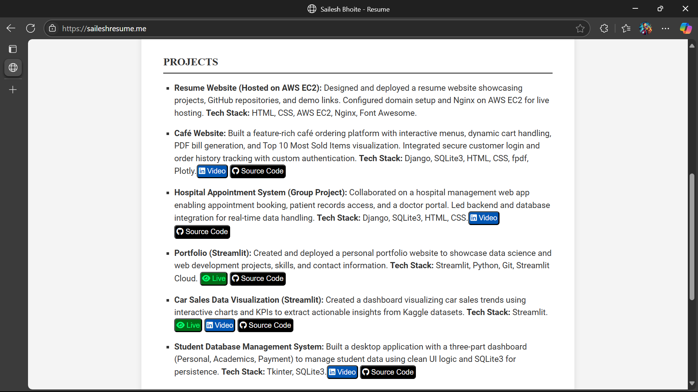

# 🌐 Personal Resume Website (Hosted on AWS EC2)

## 📄 Overview
This is a lightweight resume website designed using pure HTML and CSS. It showcases my skills, education, projects, and contact information in a clean, responsive layout.

While the frontend is simple, the core of this project lies in its **deployment strategy**—the site is hosted on an Amazon EC2 instance using manual configuration and DNS integration.

---

## 🚀 Deployment Details

- **Cloud Provider**: AWS EC2 (Amazon Linux 2)
- **Web Server**: Apache HTTP Server
- **Deployment Type**: Static site (HTML/CSS)
- **Domain Mapping**: Configured via Route53 with custom DNS settings
- **File Upload**: HTML/CSS files deployed via SCP to `/var/www/html/`
- **Public Accessibility**: Enabled via open HTTP port in EC2 security group
- **Persistence Strategy**: Manual updates pushed using `scp`, future updates will use version control hooks

---

## 🔐 Security Configuration

- **Access**: SSH login using `.pem` key
- **Inbound Rules**: Port 22 for SSH, Port 80 for HTTP
- **Firewall**: Managed using AWS Security Groups
- **Optional SSL**: Can be enabled using Let's Encrypt and Certbot

---

## 🧠 Learnings & Takeaways

- Understanding EC2 instance management and secure access
- Configuring Apache for static site hosting
- DNS mapping and handling domain propagation delays
- Practical exposure to cloud deployment pipelines without third-party frameworks

---

## 🧰 Tech Stack Summary

| Feature        | Technology         |
|----------------|--------------------|
| Frontend       | HTML, CSS          |
| Hosting        | AWS EC2            |
| Web Server     | Apache HTTP Server |
| Domain Setup   | AWS Route53        |
| Transfer Method| SCP/SSH            |

---

## 📸 Screenshot

  

<em>A glimpse of the resume homepage showcasing skills, projects, and contact links. Hosted on AWS EC2 using Apache server with custom DNS integration.</em>

---

## 🧑‍💻 Author

**Sailesh** – Final-year B.E. Computer Engineering student passionate about cloud deployment, web technologies, and clean design systems.

Check out my other projects on [GitHub](https://github.com/Sailesh-Bhoite/) and reach out for collaborations!

